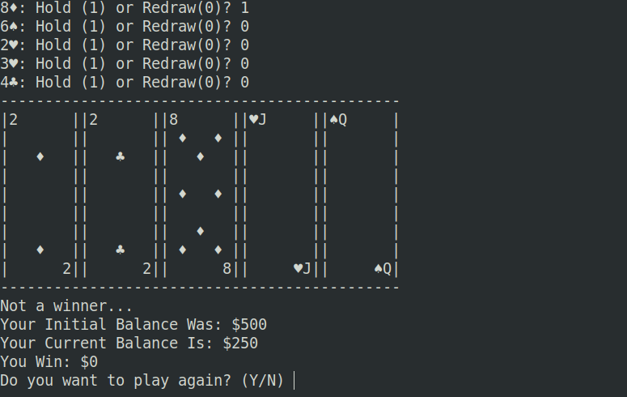

# Casino Game

Created in December 2023 in C++ through VIM in a Linux VM, this program serves as a console-based Casino game, featuring Blackjack & Poker.

## Poker

Upon choosing Poker, the user will firstly be asked to enter an initial amount for the session, and a betting amount for each game. 

Then, the computer will randomly generate 5 cards, asking the user if they would like to hold or redraw each card. This is done until all cards have been covered, in which case the program will print the cards and will display the win status and other relevent information.

Additionally, after each hand, the computer will ask if the user would like to play again.

Alternatively, if the user runs out of money, the program will exit itself.

## Blackjack

Similarly to Poker, players will be asked for a starting and betting amount.

Then, the computer will randomly generate two random face-up cards for the user and a random face up and face down card for the Dealer. The user will then be able to hold or hit until a bust.

Once the user holds, the computer will reveal their face-down card and draw until the reach 18 or greater. 

Similarly to Poker, the program will display the winnings upon the completion of the hand.

Lastly, the program will ask the user if they would play again, immediately exiting if the user has no money left.

### Created by: JJ McCauley - Salisbury University Class of 2026

